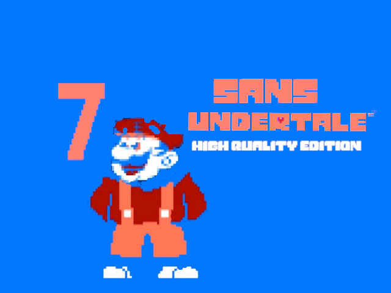

<<<<<<< Updated upstream
# Undertale Siivagunner Mod

A very high quality mod for Undertale. 

## How to Use

1. Copy your Undertale folder (i. e. the folder that contains UNDERTALE.exe; it can be found in "SteamLibrary/steamapps/common" if you've got the game from Steam) and name the copy anything you like, for example "GRAND TALE 7".
2. Download this mod by clicking the green button that reads "Code" on this page and choosing "Download as ZIP".
3. Replace the audio by just pulling the contents of the zipfile into your copied Undertale music and choosing "replace" for all files.

Now your sanity and mine can die together!

## Credits

Original rips made by the [Siivagunner](https://www.youtube.com/c/SiIvaGunner) team.

Grand Dad, Megalovania dialogues, mus_birdnoise.ogg, mus_chokedup.ogg taken from [Grandlovania](https://www.mediafire.com/file/zzbv5ozifb7pout/Grandlovania_The_Grandest_Fight_Ever_Made.zip/file) mod by [Izzy's Archives](https://www.youtube.com/channel/UCYR8ul_fYtxJVn5FF9SrLNQ).

Grand Dad Megalovania remix created by ZoruaPaul.
=======
# Undertale Siivagunner Mod

A very high quality mod for Undertale. 

## How to Use

1. Copy your Undertale folder (i. e. the folder that contains UNDERTALE.exe; it can be found in "SteamLibrary/steamapps/common" if you've got the game from Steam) and name the copy anything you like, for example "GRAND TALE 7".
2. Download this mod by clicking the green button that reads "Code" on this page and chossing "Download as ZIP".
3. Replace the audio by just pulling the contents of the zipfile into your copied Undertale music and choosing "replace" for all files.

Now your sanity and mine can die together!
>>>>>>> Stashed changes
